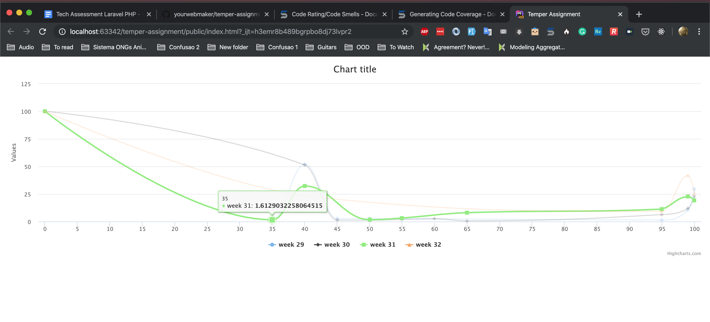

# Temper coding Assignment

### Install and Run
- `composer install`
- `php -S localhost:8000 public/oop.php`
- Open the `public/index.html` on your browser

### Tests
Just run `./vendor/bin/phpunit tests`

### Items to talk about the meeting
- Error on the CSV
- Data assignments x classes

### Screenshot
